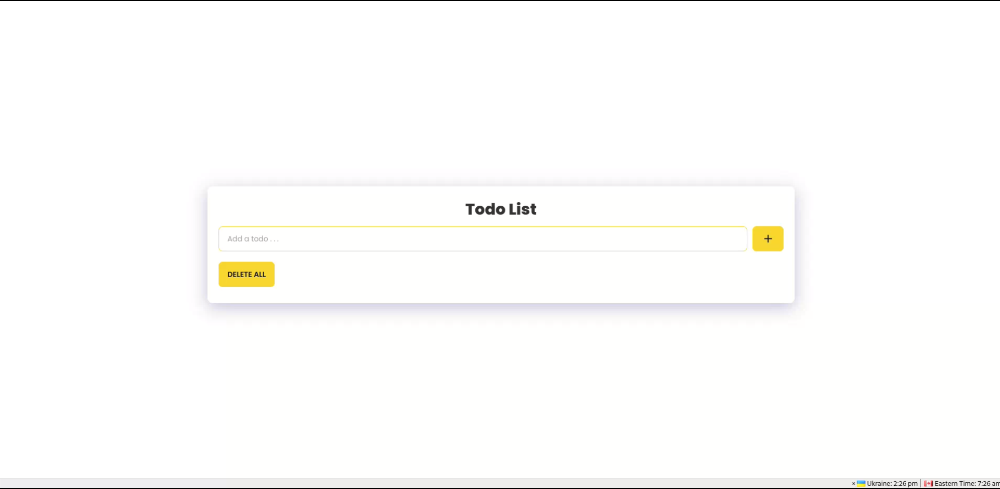

<h2> An app to manage TODO list </h2>

1. Build the backend 
```cargo build --release```
2. Run ```./target/release/todo```
3. Open `frontend/index.html` in your browser 
4. Use it


<h3> Example usage </h3>

[](example/example-usage.webm "Example usage")


